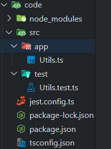
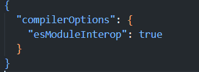

# Jest Introduction

#### What is Jest ?

- JavaScript/TypeScript testing framework

- Developed by facebook

- Test runner

- Set of global functions : describe,test,expect(From the moment we install jest as a dependency inside our project we will have acess to these global functions)

- Assertion library

- Powerful set of matchers

#### Advantages of Jest

- Most popular test framework , most supported 

- All in one solution  (test runner,asserting library,matchers)

- TypeScript support

#### Jest Project Setup

First we initialize a node project with `npm init -y`

Then we add our dependencies `npm i -D typescript jest ts-jest @types/jest ts-node`

Then we create a jest.config.ts file, The folder structure will look like this 



jest.config.ts file 

```ts

// Import the Config type from Jest's TypeScript definitions

import type { Config } from "@jest/types";

const config: Config.InitialOptions = {

  // Use "ts-jest" preset, which allows Jest to run TypeScript tests

  preset: "ts-jest",

  // Set the test environment to "node", meaning tests will run in a Node.js environment

  testEnvironment: "node",

  // Enable verbose mode, so Jest provides detailed test output in the console

  verbose: true,

};

export default config;

```

Then we create a folder called src , our actual code will be in the app folder , our tests will be in the test folder .We are testing utils.ts file 

```ts
utils.ts in app folder 
export function toUpperCase(arg: string) {

  return arg.toUpperCase();

}

```

In our test folder we will have a `Utils.test.ts` file ,it can also be called `Utils.spec.ts` file(Jest undertstands this is a test file whenever it sees `.test` or `.spec` ) , Utils.test.ts file is shown below  

```ts
import { toUpperCase } from "../app/Utils";


// `describe` groups multiple related tests into a single test suite
describe("Utils test suite", () => {

 // `test` defines an individual test case
  test("should return uppercase", () => {

    const result = toUpperCase("abc");

    // Use Jest's `expect` function to assert the expected output
    expect(result).toBe("ABC");

  });

});

```

We need to configure our npm for jest like this 

```ts
"scripts": {

    "test": "jest"

  },

```

now we can run our tests like `npm test`   , we also need to configure our `tsconfig.json` file



# Structure of an Unit test

Structure of a properly written unit test(Universal convention) is the AAA principles

- Arrange(Put everything we need in orde to test)

- Act 

- Asserrt 

- Setup

- Teardown

(Setup and Teardown are used for more complex tests)

Utils.test.ts

```ts
import { toUpperCase } from "../app/Utils";

describe("Utils test suite", () => {

  it("should return uppercase of a valid string", () => {

    //arrange, sut=>system under test

    const sut = toUpperCase;

    const expected = "ABC";

    //act

    const actual = sut("abc");

    //assert:

    expect(actual).toBe("ABC");

  });

});


```

# Jest assertions and matchers

Utils.ts

```ts
export function toUpperCase(arg: string) {

  return arg.toUpperCase();

}

// Type definition for `stringInfo` object

export type stringInfo = {

  lowerCase: string;

  upperCase: string;

  characters: string[];

  length: number;

  extraInfo: Object | undefined;

};

// Function that returns detailed information about a string

export function getStringInfo(arg: string): stringInfo {

  return {

    lowerCase: arg.toLowerCase(),

    upperCase: arg.toUpperCase(),

    characters: Array.from(arg),

    length: arg.length,

    extraInfo: {},

  };

}


```

Utils.test.ts

```ts
import { getStringInfo, toUpperCase } from "../app/Utils";

// `describe` groups multiple related tests into a single test suite

describe("Utils test suite", () => {

  // Test case for `toUpperCase` function

  it("should return uppercase of a valid string", () => {

    //arrange:Define the function under test (SUT=>system under test)

    const sut = toUpperCase;

    const expected = "ABC";

    //act

    const actual = sut("abc");

    //assert:

    expect(actual).toBe("ABC");

  });

  //it.only ensures that Jest runs only this test case , ignoring others

  it.only("should return info for valid string", () => {

    const actual = getStringInfo("My-String");

    //for primitives use toBe(Assert:verify the lowercase version)

    expect(actual.lowerCase).toBe("my-string");

    //for objects use toEqual (Assert:Check that extraInfo is an empty object)

    expect(actual.extraInfo).toEqual({});

    //Assert : verify length using two methods

    expect(actual.characters.length).toBe(9);

    expect(actual.characters).toHaveLength(9);

    //Assert:Verify the array of characters

    expect(actual.characters).toEqual([

      "M",

      "y",

      "-",

      "S",

      "t",

      "r",

      "i",

      "n",

      "g",

    ]);

    // Assert : Chec if "M" is in the array

    expect(actual.characters).toContain<string>("M");

    //Assert: Ensure array contains all given elements(in any order)

    expect(actual.characters).toEqual(

      expect.arrayContaining(["S", "t", "r", "i", "n", "g", "M", "y", "-"])

    );

    //Assert : Ensure extraInfo is not undefined

    expect(actual.extraInfo).not.toBe(undefined);

    expect(actual.extraInfo).not.toBeUndefined();

    //Assert : Ensure extraInfo is defined

    expect(actual.extraInfo).toBeDefined();

    //Asssert :Ensure extraInfo is truthy

    expect(actual.extraInfo).toBeTruthy();

  });

});

```

## Multiple tests structure

The way we are writing tests it would be difficult to find the right spot where the problem is .For this we should write more meaningful unit tests 


**Nested `describe()` for Better Organization**  
🔹 Groups all `getStringInfo()` tests together for **better readability**.  
🔹 Makes test output **easier to navigate**.  

Utils.test.ts

```ts
import { getStringInfo, toUpperCase } from "../app/Utils";

// `describe` groups multiple related tests into a single test suite

describe("Utils test suite", () => {

  // Test case for `toUpperCase` function

  it("should return uppercase of a valid string", () => {

    //arrange:Define the function under test (SUT=>system under test)

    const sut = toUpperCase;

    const expected = "ABC";

    //act

    const actual = sut("abc");

    //assert:

    expect(actual).toBe("ABC");

  });

  describe("getStringInfo for arg My-string should", () => {

    test("return right length  ", () => {

      const actual = getStringInfo("My-String");

      expect(actual.characters).toHaveLength(9);

    });

    test("return right lower case", () => {

      const actual = getStringInfo("My-String");

      expect(actual.lowerCase).toBe("my-string");

    });

    test("return right upper case", () => {

      const actual = getStringInfo("My-String");

      expect(actual.upperCase).toBe("MY-STRING");

    });

    test("return right charcaters", () => {

      const actual = getStringInfo("My-String");

      //Assert:Verify the array of characters

      expect(actual.characters).toEqual([

        "M",

        "y",

        "-",

        "S",

        "t",

        "r",

        "i",

        "n",

        "g",

      ]);

      // Assert : Chec if "M" is in the array

      expect(actual.characters).toContain<string>("M");

      //Assert: Ensure array contains all given elements(in any order)

      expect(actual.characters).toEqual(

        expect.arrayContaining(["S", "t", "r", "i", "n", "g", "M", "y", "-"])

      );

    });

    test("return defined extra info", () => {

      const actual = getStringInfo("My-String");

      expect(actual.extraInfo).toBeDefined();

    });

    test("return right extra info", () => {

      const actual = getStringInfo("My-String");

      expect(actual.extraInfo).toEqual({});

    });

  });

});


```

# Parametized test

```ts
// `describe.only()` ensures that only this test suite runs, ignoring others
describe.only("ToUpperCase examples", () => {  

    // `it.each()` allows running the same test multiple times with different inputs
    it.each([
      { input: "abc", expected: "ABC" },          // Test case 1: "abc" → "ABC"
      { input: "My-String", expected: "MY-STRING" },  // Test case 2: "My-String" → "MY-STRING"
      { input: "def", expected: "DEF" },          // Test case 3: "def" → "DEF"
    ])(
      // `$input` and `$expected` are placeholders that dynamically insert values from the array
      "$input toUpperCase should be $expected",   
    
      // The test function receives `input` and `expected` values for each case
      ({ input, expected }) => {  
    
        // Act: Call the function being tested
        const actual = toUpperCase(input);
    
        // Assert: Verify that the output matches the expected value
        expect(actual).toBe(expected);
      }
    );

});

```


